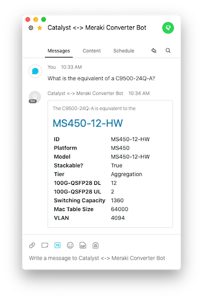
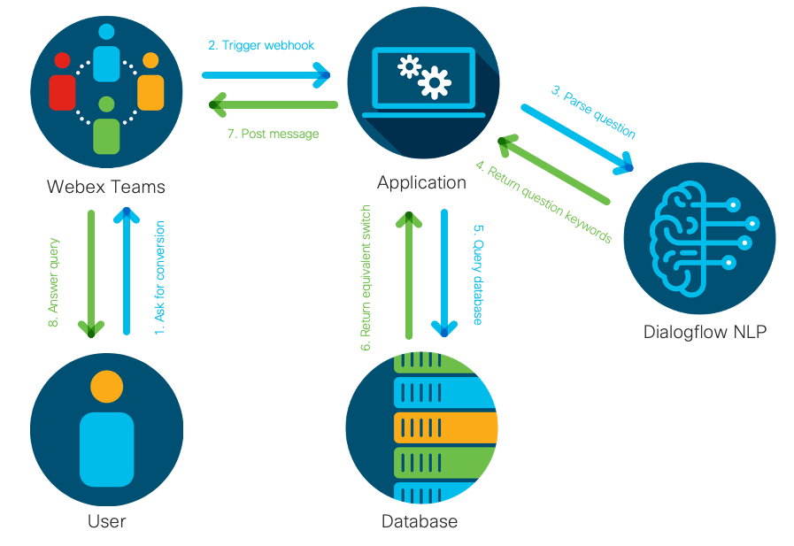

# Meercat - Meraki and Catalyst Switch Conversion

A Webex Teams bot to provide product conversion between the Catalyst and Meraki platforms through natrual language.



## Usage

You can ask the Webex Teams bot various questions in natural language to convert between various Meraki and Catalyst switch models.

For example:  

*`What is the equivalent of a C9500-24Q-A?`*  
*`Convert a MS390-48UX2-HW with a MOD-2X40G network module to catalyst`*  
*`Convert C9300L-48T-4G-E to meraki`*

Type `help` to see a list of available commands.

## Solution Components



- [Python 3](https://www.python.org/)
- [Flask](https://flask.palletsprojects.com/en/1.1.x/)
- [Dialogflow](https://dialogflow.com/)
- [MySQL](https://www.mysql.com/)
- [Webex Teams](https://developer.webex.com/)

## Self Deployment

As this bot relies on the Dialogflow NLP cloud platform - you will need to set up and configure your own trained model in order to deploy a local instance of this bot.

### Configuration

It is required to create an `.env` file in the project directory to hold the following variables:

```python3
WEBEX_TEAMS_ACCESS_TOKEN=XXXXXX
DIALOGFLOW_PROJECT_ID=XXXXXX
GOOGLE_APPLICATION_CREDENTIALS=XXXXXX.json
DATABASE_URL='mysql+mysqlconnector://root@127.0.0.1:3306/catalyst_meraki'
```

#### `WEBEX_TEAMS_ACCESS_TOKEN`

The access token for your Webex Teams bot. Create one [here](https://developer.webex.com/docs/bots).

#### `DIALOGFLOW_PROJECT_ID`

Dialogflow requires setup to allow API access to different projects.  

See [Dialogflow Setup](###Dialogflow-Setup).

#### `GOOGLE_APPLICATION_CREDENTIALS`

The path to your Google service account authentication credientials file. See above to setup through Dialogflow.

See [Dialogflow Setup](###Dialogflow-Setup).

#### `DATABASE_URL`

The MYSQL URI to the database holding switch information.

A local database could be: `mysql+mysqlconnector://root@127.0.0.1:3306/catalyst_meraki`

See [Database Setup](##Database-Setup) for information on setting up the database.

### Database Setup

1. Edit `/tools/Catalyst_Meraki_Mapping.xlsm` as required.
2. Navigate to the "Database" worksheet. Click the "Generate Script" button. This will generate a file called `import_script.sql` in the `tools` directory.
3. Install and start the MySQL server on your local computer. On mac this can be done with `brew install mysql` and `mysql.server start`
4. In the command line, navigate to the `tools` directory and run:

   ```bash
   $ mysql -u root < create_table.sql
   $ mysql -u root < import_script.sql
   ```

5. Your new MySQL database will now be accessable at `mysql+mysqlconnector://root@127.0.0.1:3306/catalyst_meraki`

### Dialogflow Setup

Setup a Dialogflow project with the following steps:

1. Select or create a Cloud Platform [project](https://console.cloud.google.com/project).
2. [Enable billing](https://support.google.com/cloud/answer/6293499#enable-billing) for your project.
3. [Enable the Google Cloud Dialogflow API](https://console.cloud.google.com/flows/enableapi?apiid=dialogflow.googleapis.com).
4. [Set up authentication](https://cloud.google.com/docs/authentication/getting-started) with a service account so you can access the API from your local workstation.

The Dialogflow model for this bot has been trained using various training phrases and entities created from the database. To setup for local testing, your Dialogflow project will need to have an intent that parses out two parameters:

1. **`Model`**
2. **`Network_Module`**

The fulfillment webhook also needs to be enabled to point to the `/compare` app route.

### Installation

1. Create and activate a python3 virtual environment:

   ```bash
   $ python3 -m venv venv
   $ source venv/bin/activate
   ```

2. Install packages `pip install -r requirements.txt`
3. Create .env file `touch .env` with appropriate tokens. See [Configuration](#Configuration).
4. Run `ngrok http 5000`
5. Create Webex webhooks `$ python tools/create_webhooks.py`
6. Run application `flask run`
